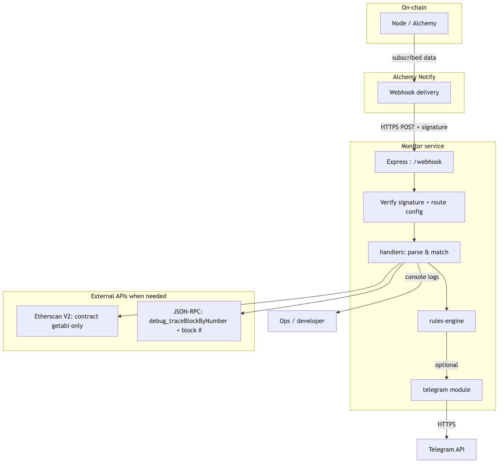
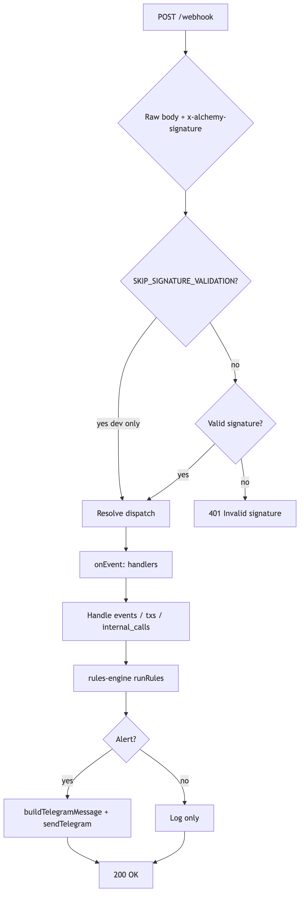
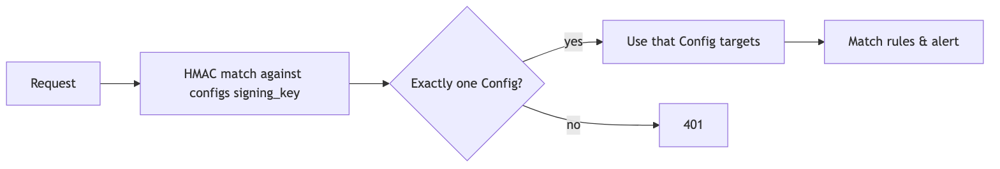
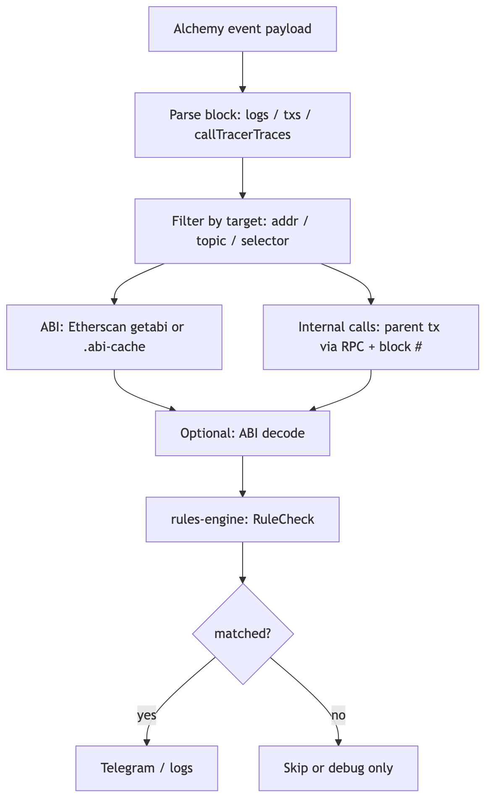
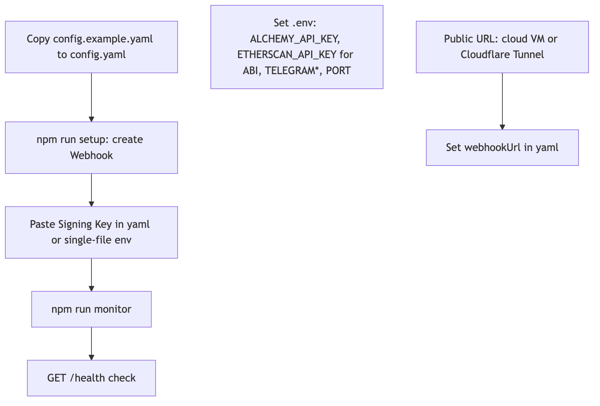
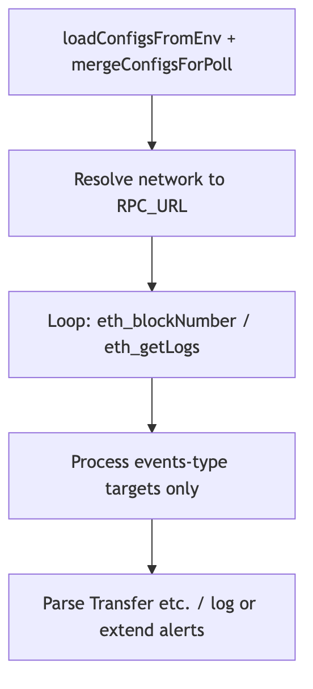

# Monitor (Alchemy Chain Monitor) — Product Requirements Document (PRD)

**Repository:** `alchemy-chain-monitor` (Node.js / TypeScript)

[简体中文](#prd-chinese)

---

## English

### 1. Product overview

#### 1.1 One-line summary

Monitor is an on-chain monitoring service built on **Alchemy Notify Webhooks**. It listens on a configured network for contract **events (logs)**, **external transactions**, and **internal calls (callTracer)**. After YAML rule matching, it logs to the console and optionally pushes alerts to **Telegram**.

#### 1.2 Problems and value

| Problem | Value |
|---------|--------|
| Many contracts/addresses need monitoring (upgrades, roles, treasury calls, etc.) | Centralized config and labeled alerts |
| Block explorers alone miss internal `delegatecall` / sub-calls | Internal calls plus `methodSelectors` filters |
| Multiple tenants share one process | Multiple YAML files; route by `x-alchemy-signature` |
| Webhooks unavailable or impractical | **Polling** over RPC (mainly for `events`) |

#### 1.3 Non-goals

- Not a block explorer or indexer; does not persist full-chain history long term.
- Does not custody keys or submit transactions on users’ behalf.
- Deployment-script mistakes and pure config errors (duplicate/placeholder addresses) are out of scope for this PRD as product defects (handle in ops/deploy review).

### 2. Users and scenarios

#### 2.1 User roles

| Role | Needs |
|------|--------|
| Protocol / security engineer | Proxy upgrades, timelocks, multisig execution, role changes |
| Ops / DevOps | Public deployment, health checks, multi-env config |
| CS / project owner | Per-project YAML, separate signing keys and alert labels |

#### 2.2 Typical scenarios

1. **Safe → Timelock:** Only internal calls between given `from`/`to` with specific 4-byte selectors.
2. **ERC20 / custom events:** Filter by contract address + topics; optional `rules` (parameter ranges, caller allowlists).
3. **Multi-chain / multi-webhook:** Separate configs for e.g. ETH and Arbitrum; one process via `CONFIG_PATHS`.

### 3. Functional requirements

#### 3.1 Monitoring types (Must)

| ID | Feature | Description |
|----|---------|-------------|
| F-01 | Events | Contract logs; address lists and topics; optional `rules` |
| F-02 | Transactions | External txs involving configured addresses |
| F-03 | Internal calls | Call tracer; `methodSelectors`, `fromAddresses` / `toAddresses` |
| F-04 | Signature validation | Validates `x-alchemy-signature`; `SKIP_SIGNATURE_VALIDATION` for local dev only |
| F-05 | Multi-config routing | With multiple YAML files, match signature to one `Config`, then rules |
| F-06 | Telegram | Optional bot token and chat id |
| F-07 | Health | `GET /health` returns `ok` and timestamp |
| F-08 | ABI decode | Decode inputs/logs (explorer or file ABI) |
| F-09 | Rules engine | As implemented in code (`paramIn`, `balanceInRange`, `storageSlotEquals`, `callerNotIn`, `paramOutsideRange`, etc.) |
| F-10 | ABI & Etherscan | `ETHERSCAN_API_KEY` **only** for V2 **`contract/getabi`** (decode, `.abi-cache`, startup prefetch). Optional `ABI_FETCH_RPS` (default ~3/s); **one retry after 1s** on getabi failure |
| F-11 | Internal → parent tx | Same **block number** + **`debug_traceBlockByNumber`** on configured RPC (`ALCHEMY_API_KEY` or `*_RPC` URL). **Does not** use Etherscan `txlistinternal` |

#### 3.2 Configuration modes (Must)

| Mode | Behavior |
|------|----------|
| Single webhook | `singleWebhook: true` + `targets: { signing_key, list: [...] }`; one webhook, many rules; alert per `label` |
| Multi-group | `targets: [ { signing_key, list }, ... ]`; route by group signature, then match inside the group |
| Multi-webhook | One webhook per target; `signing_key` or env fallback in single-file mode |

Env: `CONFIG_PATHS` / `CONFIG_PATH`. With **multiple files**, put **signing keys in YAML** so validation and routing stay aligned.

#### 3.3 CLI & ops (Should)

| Command | Purpose |
|---------|---------|
| `npm run monitor` | Start webhook server |
| `npm run setup` | Create Alchemy webhooks from config |
| `npm run setup:guide` | Print GraphQL snippets |
| `npm run poll` | Poll events via RPC when webhooks are not used |

#### 3.4 Future enhancements

More channels (email, Slack, PagerDuty); persisted alerts; Prometheus metrics.

### 4. Non-functional requirements

| Area | Requirement |
|------|----------------|
| Runtime | Node.js ≥ 18 |
| Security | No permanent `SKIP_SIGNATURE_VALIDATION` in prod; sign raw body |
| Availability | Process supervised; depends on Alchemy/RPC/Telegram |
| Observability | Structured logs (webhook id, block, matched config path) |
| Config | Clear YAML errors; merged GraphQL dedupes addresses/topics |
| Etherscan usage | Rate-limited getabi only; no account/internal-tx APIs for parent-hash resolution |

### 5. Architecture and flowcharts

The figures below are **white-background PNGs**; **diagram labels are in English** (sources: `docs/flowcharts/*.mmd`). From the repository root run:

`npx @mermaid-js/mermaid-cli@11 -i docs/flowcharts/01-architecture.mmd -o docs/flowcharts/01-architecture.png -b white -s 2`

Replace the basename or batch all `.mmd` files (`-s 2` improves PNG sharpness). Images in this file use `./flowcharts/<name>.png` relative to `docs/PRD.md`.

#### 5.1 High-level architecture

On-chain data reaches Monitor via Alchemy Notify; handlers may call **Etherscan (getabi only)** and **JSON-RPC (e.g. `debug_traceBlockByNumber`)**; after verification and rules, optional Telegram delivery.

#### 5.2 Webhook request flow

POST `/webhook` → verify & dispatch → handlers → rules engine → alert or log → 200.

#### 5.3 Multi-config signature routing

Match HMAC against each config’s `signing_key`; exactly one config continues, else 401.

#### 5.4 From payload to alert decision

Parse block → filter by target → **internal calls:** map each trace to a parent tx hash via **RPC + block #**; **ABI:** Etherscan getabi or disk cache → optional decode → rules engine → alert if matched.

#### 5.5 Ops: config to production

Copy config → set `.env` (Alchemy key for RPC, Etherscan key for ABI, Telegram, etc.) → public URL → setup → signing keys → `npm run monitor` → `/health`.

#### 5.6 Polling mode

Merge configs → pick RPC → loop `eth_blockNumber` / `eth_getLogs` → handle `events` targets.

### 6. Data & config contracts (summary)

- **Network:** `network` must align with RPC mapping and env vars.
- **Signing:** Use the **raw request body** (`rawBody` in Express).
- **GraphQL:** Merged queries dedupe addresses/topics; `methodSelectors` and `rules` apply only on the server.
- **Etherscan API key:** Used **only** for **`contract/getabi`** (and startup prefetch into `.abi-cache/`). Not used for resolving internal-call parent transactions.
- **Internal parent tx:** Resolved with **block number** + **`debug_traceBlockByNumber`** on the configured RPC endpoint.

### 7. Acceptance criteria

1. With correct webhook and signing keys, target events trigger logs and (if configured) Telegram within seconds.
2. With multiple YAML files, a wrong signature must not trigger another tenant’s rules.
3. `GET /health` is suitable for load-balancer health checks.
4. `npm test` (Vitest) passes (per CI/local).

### 8. Related documents

[README.md](../README.md); [DEPLOY.md](../DEPLOY.md), [DEPLOY-ALIYUN.md](../DEPLOY-ALIYUN.md); [SETUP-WEBHOOK.md](../SETUP-WEBHOOK.md).

---

## 中文

[English](#prd-english)

### 1. 产品概述

#### 1.1 一句话描述

Monitor 是一套基于 **Alchemy Notify Webhook** 的链上监控服务：在指定网络上监听合约 **事件（Logs）**、**外部交易（Transactions）** 与 **内部调用（Internal Calls / callTracer）**，按 YAML 配置的规则匹配后，向控制台与可选的 **Telegram** 推送告警。

#### 1.2 问题与价值

| 问题 | 价值 |
|------|------|
| 需关注多合约、多地址的敏感操作（升级、角色变更、金库调用等） | 集中配置、按标签分类告警 |
| 仅看浏览器不足以覆盖「合约内部的 delegatecall / 子调用」 | 支持 internal call 与 `methodSelectors` 过滤 |
| 多客户/多项目共用同一套服务进程 | 多 YAML、按 `x-alchemy-signature` 路由到对应配置 |
| 无法或不便使用 Webhook 的环境 | 提供基于 RPC 的 **轮询（poll）** 模式（主要覆盖 events） |

#### 1.3 非目标

- 不是区块浏览器、不是索引器、不长期落库存储全链历史。
- 不负责托管私钥或代用户发交易。
- 部署脚本、纯配置失误（重复地址、占位符）不在本 PRD 的「产品缺陷」范围内（运维与部署审查单独处理）。

### 2. 目标用户与场景

#### 2.1 用户角色

| 角色 | 诉求 |
|------|------|
| 协议/安全工程师 | 监控代理升级、Timelock、多签执行、角色变更 |
| 运维 / DevOps | 公网部署、健康检查、多环境配置 |
| 客户成功 / 项目方 | 按项目拆分 YAML、独立 Signing Key 与告警文案（label） |

#### 2.2 典型场景

1. **Safe → Timelock**：只关心特定 `from`/`to` 间、特定 4 字节 selector 的内部调用。
2. **ERC20 / 自定义事件**：按合约地址 + topic 过滤，可叠加 `rules`（参数范围、调用者白名单等）。
3. **多链、多 Webhook**：ETH 与 Arbitrum 各一配置，同一进程 `CONFIG_PATHS` 加载。

### 3. 功能需求

#### 3.1 监控类型（Must）

| ID | 功能 | 说明 |
|----|------|------|
| F-01 | Events | 监控合约日志；支持地址列表与 topics；可配置 `rules` |
| F-02 | Transactions | 监控与指定地址相关的外部交易 |
| F-03 | Internal calls | 基于 call tracer；支持 `methodSelectors`、`fromAddresses` / `toAddresses` |
| F-04 | 签名校验 | 校验 `x-alchemy-signature`；`SKIP_SIGNATURE_VALIDATION` 仅本地调试 |
| F-05 | 多配置路由 | 多 YAML 时按签名命中唯一 `Config`，再执行该配置内规则 |
| F-06 | Telegram | 可选：`TELEGRAM_BOT_TOKEN`、`TELEGRAM_CHAT_ID` |
| F-07 | 健康检查 | `GET /health` 返回 `ok` 与时间戳 |
| F-08 | ABI 解码 | 解码 input/log（浏览器或本地 ABI） |
| F-09 | 规则引擎 | `paramIn`、`balanceInRange`、`storageSlotEquals`、`callerNotIn`、`paramOutsideRange` 等（以代码为准） |
| F-10 | ABI 与 Etherscan | `ETHERSCAN_API_KEY` **仅**用于 V2 **`contract/getabi`**（解码、`.abi-cache`、启动预取）。可选 `ABI_FETCH_RPS`（默认约 3/s）；getabi 失败时 **等待 1 秒再重试一次** |
| F-11 | Internal → 父交易 | 同一**块号** + 已配置 RPC 上的 **`debug_traceBlockByNumber`**（`ALCHEMY_API_KEY` 或 `*_RPC`）。**不使用** Etherscan `txlistinternal` |

#### 3.2 配置模式（Must）

| 模式 | 行为概要 |
|------|----------|
| 单 Webhook | `singleWebhook: true` + `targets: { signing_key, list: [...] }`，一条 Webhook 多规则，按 `label` 告警 |
| 多组 | `targets: [ { signing_key, list }, ... ]`，先按组签名分流，再组内匹配 |
| 多 Webhook | 每个 target 独立 Webhook；`signing_key` 或单文件时 env 兜底 |

环境变量：`CONFIG_PATHS` / `CONFIG_PATH`；多文件时 **Signing Key 应写在 YAML**，避免签名校验通过但路由错误。

#### 3.3 CLI / 运维（Should）

| 命令 | 用途 |
|------|------|
| `npm run monitor` | 启动 Webhook 服务 |
| `npm run setup` | 按配置创建 Alchemy Webhook |
| `npm run setup:guide` | 输出 GraphQL 片段 |
| `npm run poll` | 无 Webhook 时 RPC 轮询 events |

#### 3.4 可选增强

更多通知渠道；告警持久化与检索；Prometheus 等指标。

### 4. 非功能需求

| 类别 | 要求 |
|------|------|
| 运行时 | Node.js ≥ 18 |
| 安全 | 生产勿长期 `SKIP_SIGNATURE_VALIDATION`；验签用原始 body |
| 可用性 | 进程由 supervisor 等拉起；依赖 Alchemy/RPC/Telegram |
| 可观测性 | 结构化日志（webhook id、块高、命中配置路径） |
| 配置 | YAML 报错清晰；合并 GraphQL 对地址/topic 去重 |
| Etherscan 使用范围 | 仅对 getabi 限流；不用账户类/internal tx 接口解析父交易 |

### 5. 系统架构与流程图

下列 **PNG** 为白底导出；**流程图内文字为英文**（源文件 `docs/flowcharts/*.mmd`）。在仓库根目录执行：

`npx @mermaid-js/mermaid-cli@11 -i docs/flowcharts/01-architecture.mmd -o docs/flowcharts/01-architecture.png -b white -s 2`

可将 `01-architecture` 换成其他文件名，或对目录内全部 `.mmd` 批量执行（`-s 2` 提高 PNG 清晰度）。`docs/PRD.md` 中图片路径为 `./flowcharts/<name>.png`（相对本文件）。

#### 5.1 总体架构

链上数据经 Alchemy Notify 推送至 Monitor；handlers 可按需调用 **Etherscan（仅 getabi）** 与 **JSON-RPC（如 `debug_traceBlockByNumber`）**，验签与规则处理后可选 Telegram。

#### 5.2 Webhook 请求处理主流程

POST `/webhook` → 验签与 dispatch → handlers → 规则引擎 → 告警或日志 → 200。

#### 5.3 多配置文件签名路由

HMAC 与各 `config` 的 `signing_key` 匹配，命中唯一配置后继续；否则 401。

#### 5.4 从块数据到是否告警

解析 block → 按 target 过滤 → **internal_calls：** 用 **RPC + 块号** 将 trace 映射到父交易哈希；**ABI：** Etherscan getabi 或本地缓存 → 可选解码 → 规则引擎 → 匹配则告警。

#### 5.5 运维：从配置到上线

复制配置 → 配置 `.env`（Alchemy RPC、Etherscan ABI、Telegram 等）与公网 URL → setup → 写入 Signing Key → `npm run monitor` → `/health`。

#### 5.6 轮询模式（Poll）

合并配置 → 选 RPC → 循环 `eth_blockNumber` / `eth_getLogs` → 处理 events 类 target。

### 6. 数据与配置契约（摘要）

- **网络标识**：`network` 与 RPC 映射、环境变量一致。
- **验签**：使用请求 **原始 body**（Express 保存 `rawBody`）。
- **GraphQL**：合并查询对地址、topic 去重；`methodSelectors`、`rules` 仅在服务端生效。
- **Etherscan API Key**：**仅**用于 **`contract/getabi`**（及启动预写入 `.abi-cache`），不用于解析 internal 父交易。
- **Internal 父交易哈希**：依赖 **块号** + 配置 RPC 上的 **`debug_traceBlockByNumber`**。

### 7. 成功标准

1. Webhook 与 Signing Key 配置正确时，目标事件可秒级触发日志与（若配置）Telegram。
2. 多 YAML 下，错误签名不会误触发其他项目规则。
3. `GET /health` 可用于负载均衡存活探测。
4. `npm test`（Vitest）通过（以 CI/本地为准）。

### 8. 相关文档

仓库根目录 [README.md](../README.md)；[DEPLOY.md](../DEPLOY.md)、[DEPLOY-ALIYUN.md](../DEPLOY-ALIYUN.md)；[SETUP-WEBHOOK.md](../SETUP-WEBHOOK.md)。
